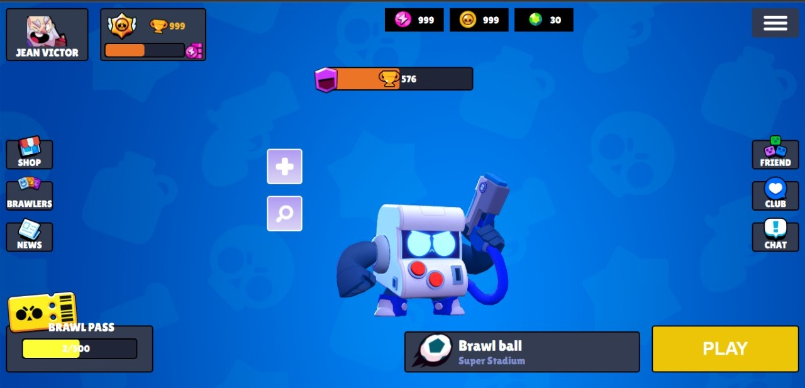

<p align="center">
  
<p>

<p align="center">
  

  

  
  <a href="https://github.com/JeanVictor44/BrawlStars-UI/commits/main">
    
  </a>

  
</p>


## Sobre o projeto
:video_game: Brawl Stars UI é um projeto Front End de clonagem do jogo mobile Brawl Stars feito por um ex admirador e jogador. Com ele é possível cadastrar seu nome e sua idade, escolher um ícone para o seu perfil e o brawler preferido(personagem). A aplicação irá gerar uma página principal semelhante a do jogo, porém custumizado com seu nome, o ícone e brawler escolhido. Opção de pesquisar os jogadores e os clubes existentes no game são outras funções presentes, além de trazer as animações dos brawlers.  



> Página principal

## :art: Layout
<p align="center" style="display: flex; align-items: flex-start; justify-content: center;">
   
</p>

## :hammer_and_wrench: Tecnologias

As seguintes ferramentas foram usadas na construção do projeto:

- [React ](https://pt-br.reactjs.org/)
- [TypeScript](https://www.typescriptlang.org/)
- [React testing Library](https://testing-library.com/)
- [React-Router-Dom v6](https://reactrouter.com/docs/en/v6)
- [Styled-components](https://styled-components.com/)
- [Axios](https://axios-http.com/docs/intro)
- [Npm](https://www.npmjs.com/)


### Ajustes e melhorias

O projeto ainda está em desenvolvimento e as próximas atualizações serão voltadas nas seguintes tarefas:

- [x] Criar página para registro do nome 
- [x] Criar página para registro da idade
- [x] Criar página principal 

## Pré-requisitos

Antes de começar, você vai precisar ter instalado em sua máquina as seguintes ferramentas:
[Git](https://git-scm.com), [Node.js](https://nodejs.org/). Além disto é bom ter um editor para trabalhar com o código como [VSCode](https://code.visualstudio.com/)

## :rocket: Como executar o projeto

```bash
# Clone este repositório
$ git clone https://github.com/JeanVictor44/BrawlStars-UI

# Acesse a pasta do projeto no seu terminal/cmd
$ cd BrawlStars-UI

# Instale as dependências
$ npm install

# Execute a aplicação em modo de desenvolvimento
$ npm run start
      ou
$ yarn dev

# A aplicação será aberta na porta:3000 - acesse http://localhost:3000
```

## :pencil: Licença

Esse projeto está sob licença. Veja o arquivo [LICENÇA](LICENSE) para mais detalhes.
